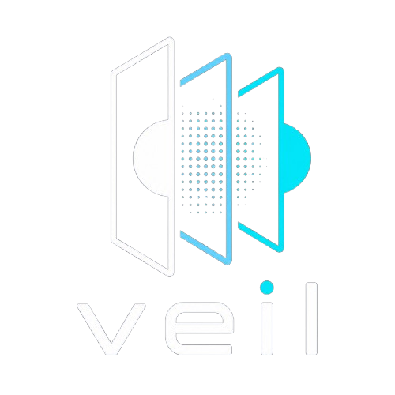

<p align="center">
  
</p>

<h1 align="center">Veil</h1>
<p align="center"><b>Hide the conversation. Not just the content.</b></p>

<p align="center">
  <a href="LICENSE"></a>
  
  
  
</p>

<p align="center">
  <a href="https://sambhavdwivedi.in">Website</a> •
  <a href="https://www.linkedin.com/in/sambhavdwivedi">LinkedIn</a> •
  <a href="../../issues">Report a Bug</a>
</p>

---

## What Is Veil

Encryption protects *what* is said. It does nothing to protect *who said it, to whom, when, and how often*. Every mainstream messaging system — encrypted or not — still routes messages through a server that sees the full communication graph: sender, receiver, timestamp, size, and frequency. That metadata alone is enough to map relationships, infer behavior, and build a complete picture of who is talking to whom, without ever decrypting a single message.

Veil is an **Oblivious Relay Fabric (ORF)** — a privacy layer built to close that gap. It fragments messages into fixed-size encrypted cells, routes each cell independently across a network of relay nodes via randomized paths, and injects cover traffic so that real communication is indistinguishable from noise. No single relay ever sees both the source and the destination of a message.

Veil does not replace end-to-end encryption. It sits underneath it, protecting the layer that encryption was never designed to protect.

---

## Core Philosophy

**Oblivious by Design** — No relay node in the network ever has enough information to identify both the sender and the receiver of a message. Compromising one node, or several, reveals nothing about who is communicating with whom.

**Uniformity Over Distinction** — Every cell in the network is the same fixed size, encrypted the same way, and indistinguishable from every other cell — real or dummy. An observer watching the entire network sees only uniform, encrypted noise.

**No Stable Patterns** — Routing paths are randomized per cell, not per session. There is no fixed circuit to fingerprint and no consistent path to correlate over time.

**Metadata Is the Threat Model** — Veil is not designed around hiding content — that problem is already solved by modern encryption. It is designed around the harder, largely unsolved problem of hiding the existence and shape of a conversation itself.

---

## How It Works

```
   Sender (A)                     ORF Relay Fabric                    Receiver (B)
       │                                                                    │
       ▼                                                                    │
 ┌───────────┐      ┌─────────────────────────────────────────┐            │
 │  Message  │      │                                         │            │
 └─────┬─────┘      │   Relay 1        Relay 2        Relay N │            │
       ▼            │  ┌───────┐     ┌───────┐      ┌───────┐ │            │
 Fragment into       │  │ knows │     │ knows │ ...  │ knows │ │            │
 fixed-size cells ──▶│  │ only  │────▶│ only  │─────▶│ only  │ │───────────▶│
       │             │  │ prev/ │     │ prev/ │      │ prev/ │ │  Reassemble
       ▼             │  │ next  │     │ next  │      │ next  │ │  + Decrypt
 Encrypt each cell   │  │  hop  │     │  hop  │      │  hop  │ │            │
 (ChaCha20-Poly1305) │  └───────┘     └───────┘      └───────┘ │            │
       │             │                                         │            │
       │             │        + Dummy cells injected            │           │
       │             │        + Randomized per-cell routing     │           │
       │             │        + Randomized timing               │           │
       └────────────▶└─────────────────────────────────────────┘            
```

Every cell that leaves a relay node is cryptographically and structurally identical to every other cell on the network, whether it carries real data or is pure cover traffic. An observer with a complete view of every relay — the strongest possible adversary — sees only a uniform stream of encrypted, uniformly-sized packets with no discernible source, destination, or pattern.

Full protocol details live in [`docs/PROTOCOL_SPEC.md`](docs/PROTOCOL_SPEC.md). What the system does and does not defend against is documented honestly in [`docs/THREAT_MODEL.md`](docs/THREAT_MODEL.md) — read that before relying on Veil for anything sensitive.

---

## Architecture

```
crates/
├── veil-core/      Fixed-size cell format, fragmentation/reassembly,
│                    encryption (ChaCha20-Poly1305) and key exchange (X25519)
├── veil-routing/    Adaptive random path selection and cover-traffic generation
├── veil-relay/      The relay node — forwards cells, never inspects contents
├── veil-sdk/        Client library for applications integrating Veil
└── veil-cli/        Command-line tool for local testing and demonstration
```

Each crate is independently buildable and testable. `veil-core` has no networking code — it is a pure cryptographic library, kept separate so it can be audited and reasoned about in isolation.

---

## Technology

**Rust** is the core language across the entire fabric. Memory safety is not optional in a system handling cryptographic keys and untrusted network input — Rust's ownership model eliminates entire classes of vulnerabilities (buffer overflows, use-after-free) at compile time, rather than relying on runtime checks.

**ChaCha20-Poly1305** handles authenticated encryption for every cell. It was chosen over AES-GCM for its strong software-only performance without requiring hardware acceleration, and its resistance to timing side-channels.

**X25519** provides the key exchange between sender and receiver, establishing shared secrets without any relay node ever participating in or observing the exchange.

**QUIC** is the intended transport layer between relay nodes — chosen for built-in encryption, connection multiplexing, and lower head-of-line blocking compared to TCP, which matters when cells from many different flows share the same links.

**Docker** is used for local multi-node relay networks during development and testing, so the fabric can be exercised end-to-end without a live deployment.

---

## Project Status

Veil is in **early, active development**. The cryptographic core and cell fragmentation layer are the current focus. This is not yet a deployable system, and it should not be treated as one until the threat model, protocol spec, and relay implementation are far more mature and independently reviewed.

Progress is tracked in [`docs/ROADMAP.md`](docs/ROADMAP.md).

---

## Getting Started

```bash
git clone https://github.com/sambhavdwivediofficial/ORF-Veil.git
cd ORF-Veil
cargo build
cargo test
```

---

## What Veil Does Not Do

Veil is not a chat application, does not store messages, does not provide backup or recovery, and does not claim compliance with any regulatory standard. It is a transport-layer privacy primitive, intended to be integrated beneath applications — not a consumer product on its own.

---

## License

Licensed under the [MIT License](LICENSE) © 2026 Sambhav Dwivedi.

<p align="center">
  <a href="https://www.linkedin.com/in/sambhavdwivedi"></a>
  <a href="https://sambhavdwivedi.in"></a>
  <a href="https://github.com/sambhavdwivediofficial"></a>
</p>

<p align="center"><i>Built & maintained by <b>Sambhav Dwivedi</b>.</i></p>
